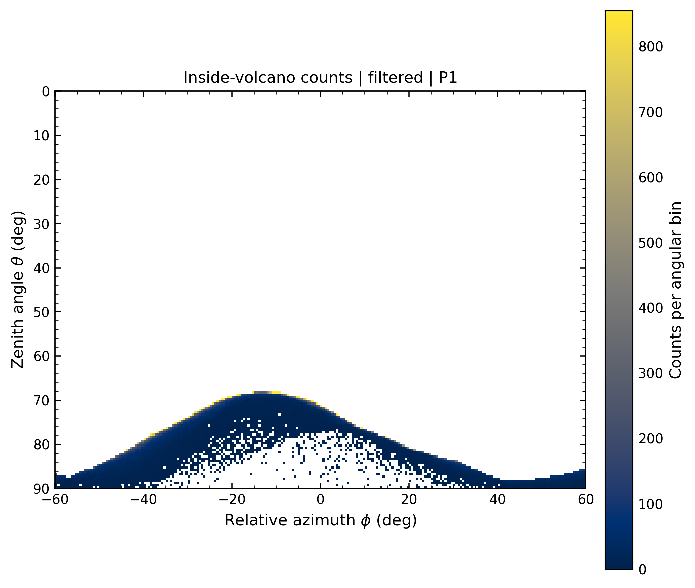
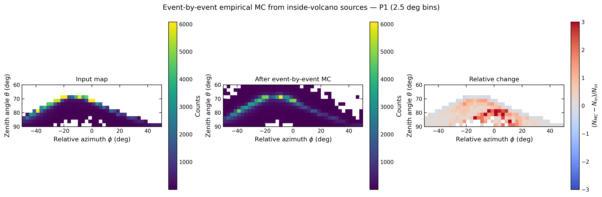
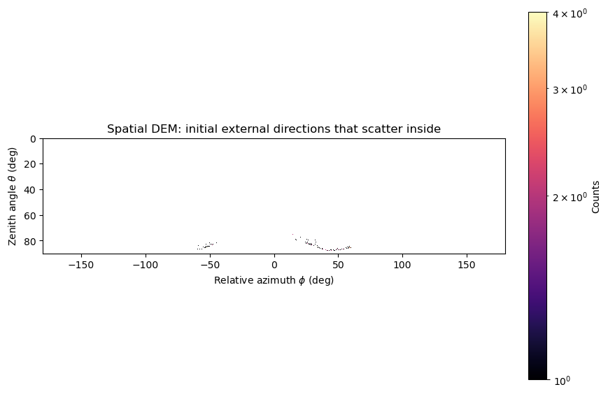

# CABRIALES

```text
   ____    _    ____  ____  ___    _    _     _____ ____
  / ___|  / \  | __ )|  _ \|_ _|  / \  | |   | ____/ ___|
 | |     / _ \ |  _ \| |_) || |  / _ \ | |   |  _| \___ \
 | |___ / ___ \| |_) |  _ < | | / ___ \| |___| |___ ___) |
  \____/_/   \_\____/|_| \_\___/_/   \_\_____|_____|____/

      \|/   \|/   '   \|/                          \|/   '   \|/   \|/
       '     "         '                            '         "     '

                           _..-~~~~~~~~~-.._
                     _..-~~  ~  ~  ~  ~  ~~~-.._
                __.-~   ~   ~   ~   ~   ~      ~-.__
           __.-~                                    ~-.__
      __.-~       ~  ~  ~  ~  ~  ~  ~  ~  ~  ~        ~-.__
__..-~                                                    ~-..__
~~~~--..__       ~   ~   ~   ~   ~   ~   ~        __..--~~~~
          ~~--..__                              __..--~~
                  ~~--..__________________..--~~

    \|/   '   \|/   \|/                              \|/   \|/   '   \|/
     '         "     '                                '     "         '
```

**Cosmic-ray AI Backpropagation and Ray-tracing with Integrated Angular
scattering for Low-cost Emulation and Simulation**

CABRIALES es un pipeline reproducible de muografía computacional. Construye la
geometría de observación sobre un DEM, calcula longitudes de roca y energías
críticas, filtra un flujo de muones y estudia migración angular e in-scattering
por multiple Coulomb scattering (MCS).

El caso validado de Machín trabaja con `P1`, `P2`, `P4` y `P5`. El punto de
entrada recomendado es `cabriales.py`; existe un solo motor interno,
`orquestador_machin.py`.

## Figuras clave

Las imágenes son ejemplos versionados. Las corridas completas se mantienen
fuera de Git por su tamaño.

| Geometría DEM y abanicos | Muograma filtrado dentro del volcán |
|---|---|
|  |  |

| MC evento por evento | Origen externo de in-scattering espacial |
|---|---|
|  |  |

## Materiales para artículo

La carpeta [articulo_prims/](articulo_prims/) reúne una instantánea curada de
los README, 33 scripts, 37 figuras y los resúmenes numéricos de los cuatro
puntos. Incluye además un índice científico y un prompt preparado para redactar
el artículo sin confundir el escalado ideal por superficie con una tasa del
detector.

## Inicio rápido

Instalar el entorno principal:

```bash
python3 -m venv .venv
source .venv/bin/activate
python3 -m pip install -r requirements.txt
```

Verificar toda la conexión del framework con una entrada pequeña:

```bash
python3 cabriales.py smoke --force
```

Ejecutar la corrida completa de 90 días, incluidos los cuatro puntos,
fast-cache, kernel empírico, event-by-event MC, background espacial y
validación:

```bash
python3 cabriales.py full --force
```

El perfil `full` usa 10 workers por defecto. Puede cambiarse con
`--workers N`. El transporte espacial usa pasos nativos de roca de `10 m`; el
nombre de la carpeta del background registra tanto el paso como los workers.

`--force` reemplaza la salida predeterminada. Para revisar primero las órdenes
sin modificar resultados:

```bash
python3 cabriales.py full --dry-run
```

Para una corrida integrada limitada a los primeros `N` eventos Monte Carlo por
punto, usar `--head N`. El límite se aplica al event-by-event MC y al background
espacial; geometría, longitudes y mapas deterministas siguen usando el cache
completo:

```bash
python3 cabriales.py full --points P1 --head 10000000 --force
```

### Kernel MCS full-tail

CABRIALES incluye y usa por defecto
`modulos/hybrid_empirical_kernel_library.npz`. La biblioteca combina 402
simulaciones, una grilla central de `-300` a `300 mrad` y colas completas de
`-1600` a `1600 mrad`, ambas con bins de `1 mrad`.

El método predeterminado es híbrido. Dentro del dominio full-tail cercano al
umbral, `tail-aware` interpola el cuerpo mediante transporte de cuantiles y,
entre `250` y `300 mrad`, transiciona a histogramas medidos locales; más allá
de `300 mrad` conserva directamente esas colas. Fuera de ese dominio usa la
familia core amplia del mismo archivo, interpolada en longitud y energía. Si
una energía excede también el rango medido del core, se muestrea primero el
histograma empírico completo del vecino y después se reescala el ángulo con la
dependencia MCS estándar `1/(beta*p)`. Así se conservan la forma y los
cuantiles raros medidos sin asignar a un muón de mayor energía el ancho angular
de uno menos energético. El corte de densidad predeterminado es cero.

En las rutas evento por evento y espaciales, una caché LRU cuantiza únicamente
la energía en pasos de `dlog(E)=0.02`. En el background, cada tramo de roca usa
el nodo nativo de `10 m` del kernel, actualiza energía y dirección, y aplica el
kick al final del tramo. Cada evento y muestra espacial tiene una semilla
determinista propia, por lo que una salida temprana no cambia los muones
posteriores. `--min-survival-rock-m 10` es solo un prefiltro CSDA de rango
inicial alineado con el primer slab; no exige una longitud mínima mayor a la
necesaria para completar ese primer paso.

La comprobación mínima del modelo es:

```bash
python3 cabriales.py kernel-smoke
```

Por defecto evalúa `L=80 m`, `E=39.67 GeV`, comprueba la normalización en la
salida de terminal y escribe el PDF angular en
`outputs/kernel_smoke/kernel_L80_E39p67.csv`. Otro modelo puede indicarse con
`--kernel-npz`; el pipeline completo registra ruta, familia, soporte angular y
método de interpolación en sus resúmenes.

La corrida definitiva de los cuatro puntos fue regenerada el 15 de julio de
2026 con el kernel híbrido, todo el cache de 90 días, `sample_probability=1`,
semilla base `12345` y 10 workers. Cada punto leyó `1,363,053,739` eventos; no
hubo consultas sin soporte del kernel. El transporte espacial acumuló 2,558,292
pasos full-tail y 47,935,842 pasos core; después de la corrección energética se
observaron 6,096 kicks mayores de `300 mrad`, 262 mayores de `500 mrad` y
ninguno mayor de `1000 mrad`.

El cache cinemático de 90 días se busca en este orden:

1. variable de entorno `CABRIALES_90D_CACHE`;
2. `data/cache/machin90dia_kinematic_cache`;
3. la ubicación histórica hermana `../CNF/muon-cnf-toolkit/`.

También puede indicarse explícitamente:

```bash
python3 cabriales.py full \
  --kinematic-cache /ruta/al/machin90dia_kinematic_cache \
  --force
```

## Progreso en terminal

Cada etapa conserva su salida detallada en `logs/` y muestra estados breves en
la terminal:

```text
CABRIALES FULL: pipeline -> background espacial -> validacion
[START] FULL 1/3 - Pipeline Machin 90 dias
[START] 01_geometry | log=.../logs/01_geometry.log
[RUNNING] 01_geometry | elapsed=1m 00s | log=...
[OK] 01_geometry | elapsed=1m 17s
[CAMPAIGN 1/4] point=P1
[PROGRESS] P1: chunks=5/10 elapsed=14m 32s
[OK] Background completo | puntos=4 | accepted=...
```

El intervalo predeterminado es 30 segundos. Puede cambiarse sin tocar código:

```bash
python3 cabriales.py full --status-interval-s 60 --force
```

## Comandos principales

| Comando | Acción |
|---|---|
| `python3 cabriales.py smoke --force` | Prueba rápida y validación integral. |
| `python3 cabriales.py machin90d --force` | Pipeline de cuatro puntos sin campaña espacial separada. |
| `python3 cabriales.py background90d --force` | Solo background espacial de cuatro puntos. |
| `python3 cabriales.py full --force` | Pipeline, background y validaciones. |
| `python3 cabriales.py validate RUTA` | Valida una corrida existente. |
| `python3 orquestador_machin.py --help` | Interfaz avanzada del único orquestador. |

`all90d` permanece como alias compatible de `full`.

## Organización

```text
CABRIALES/
├── cabriales.py                 # interfaz diaria y presets reproducibles
├── orquestador_machin.py        # único motor del pipeline
├── validar_corrida.py
├── modulos/                     # física y procesamiento por etapa
├── data/                        # DEM y tablas pequeñas de referencia
├── herramientas/
│   └── muon-cnf-toolkit/        # generador de flujo opcional e independiente
├── docs/
├── run_machin90dia_allpoints_full/  # salida local, ignorada por Git
├── requirements.txt
└── README.md
```

No hay una segunda implementación del orquestador. Las opciones avanzadas y la
lógica física viven en `orquestador_machin.py`; `cabriales.py` solo construye
configuraciones validadas y coordina pipeline, background y validación.

## Etapas de la corrida full

| Directorio | Contenido principal |
|---|---|
| `00_inputs/` | Referencias a DEM, tabla de rango y configuración de entrada. |
| `01_geometry/` | FOV, DEM, abanicos y máscaras angulares. |
| `02_lengths/` | Longitud de roca por dirección y punto. |
| `03_ecrit/` | Energía crítica necesaria para sobrevivir la roca. |
| `04_event_cache/` | Eventos compactos seleccionados por punto. |
| `05_plots/` | Mapas theta-phi. |
| `06_inside_volcano/` | Mapas filtrados dentro de la máscara del volcán. |
| `07_scattering_empirical/` | Diagnóstico del kernel empírico de MCS. |
| `08_smearing_empirical/` | Migración angular sobre mapas. |
| `09_event_mc_empirical/` | Transporte empírico evento por evento. |
| `10_in_scattering_background/` | Campaña espacial externa para P1/P2/P4/P5. |
| `logs/` | Salida completa de cada subproceso. |
| `run_manifest.json` | Configuración y estado del pipeline. |
| `pipeline_outputs.csv` | Índice de salidas principales. |

El resumen combinado del background queda en:

```text
run_machin90dia_allpoints_full/
└── 10_in_scattering_background/
    └── machin90d_4points_volcano_surface_step10m_workers10/
        ├── four_point_summary.json
        ├── four_point_summary.csv
        ├── P1/
        ├── P2/
        ├── P4/
        └── P5/
```

Cada punto conserva un chunk reproducible por worker, el resultado reducido,
mapas finales, orígenes externos, contactos con roca, histogramas y
trayectorias aceptadas.

### Resultado de referencia, 90 días

| Punto | Aceptados MC / 90 d | Tasa superficial ideal [muones/(m2 dia)] | Error relativo MC | Área objetivo ideal | Escalado ideal por día | Exposición equivalente del conteo MC |
|---|---:|---:|---:|---:|---:|---:|
| P1 | 245 | 2.7222 | 6.39% | 1.5600 km2 | 4,246,666.67 | 4.98 s |
| P2 | 244 | 2.7111 | 6.40% | 2.5475 km2 | 6,906,555.56 | 3.05 s |
| P4 | 296 | 3.2889 | 5.81% | 3.7050 km2 | 12,185,333.33 | 2.10 s |
| P5 | 231 | 2.5667 | 6.58% | 1.6375 km2 | 4,202,916.67 | 4.75 s |
| Total | 1,016 | 2.9144 ponderada | 3.14% para el conteo MC | 9.4500 km2 | 27,541,472.22 | 3.19 s ponderados |

La tasa superficial divide el conteo Monte Carlo de 90 días por `90 d * 1 m2`
y conserva la normalización original del flujo. El promedio ponderado por las
áreas objetivo es `2.914 muones/(m2 dia)`. La exposición equivalente es el
tiempo necesario sobre el área completa para acumular el mismo conteo aceptado
que la simulación normalizada a `90 d * 1 m2`; por punto es `90 d / A_eff`. El
total de área suma superficies definidas por observador y puede contener
solapamientos físicos. El escalado es un diagnóstico ideal de la superficie de
inyección; ninguna de estas cifras es una tasa instrumental.

## Generador de flujo CNF

`herramientas/muon-cnf-toolkit/` es una copia mínima del generador de flujo:

```text
muon-cnf-toolkit/
├── main-cnf.py
├── main-cnf-cabriales-cache.py
├── model.pt
├── requirements.txt
└── README.md
```

Esta herramienta **no forma parte del pipeline**. Tiene su propio modelo y sus
propias dependencias. Produce entradas que luego pueden entregarse a CABRIALES.

Instalación aislada:

```bash
cd herramientas/muon-cnf-toolkit
python3 -m venv .venv
source .venv/bin/activate
python3 -m pip install -r requirements.txt
```

Generar un `.shw`:

```bash
./main-cnf.py \
  --seconds 3600 \
  --height ALTITUD_M \
  --bx BX_MICROTESLA \
  --bz BZ_MICROTESLA \
  --device auto \
  --output flujo_1h.shw
```

Para simulaciones largas es preferible generar directamente el cache que
consume CABRIALES:

```bash
./main-cnf-cabriales-cache.py \
  --days 90 \
  --height ALTITUD_M \
  --bx BX_MICROTESLA \
  --bz BZ_MICROTESLA \
  --device auto \
  --write-workers 6 \
  --output-dir ../../data/cache/machin90dia_kinematic_cache
```

Los valores de altitud y campo geomagnético son entradas físicas y deben
calcularse para el sitio y fecha de estudio. La documentación completa del
generador está en `herramientas/muon-cnf-toolkit/README.md`.

## Alcance físico

CABRIALES separa dos preguntas:

- **Migración interna:** dirección inicialmente aceptada que termina en otro
  píxel aceptado después de MCS.
- **In-scattering externo:** dirección inicialmente fuera de la aceptación que
  atraviesa roca y termina con una dirección angular aceptada.

El background espacial actual es un diagnóstico ideal sobre superficie DEM. No
modela reflexión ni rebote: propaga MCS dentro de roca. Sus conteos escalados
por área representan una superficie de inyección ideal; no son una tasa del
detector hasta incorporar área, orientación e intersección espacial del
instrumento.

Supuestos relevantes:

- densidad efectiva de roca configurable, con valor base `2.65 g/cm3`;
- pérdida de energía basada en tabla de rango/CSDA;
- kernel empírico híbrido de MCS derivado de simulaciones Geant4, con
  interpolación `tail-aware` y soporte full-tail de `+/-1600 mrad`;
- mapas angulares en theta-phi y event-MC rebineado a `2.5 grados` por defecto;
- flujo CNF normalizado por `1 m2` de superficie de generación;
- semilla y parámetros de transporte registrados en los resúmenes JSON.

## Validación y diagnóstico

Validar la corrida principal:

```bash
python3 cabriales.py validate run_machin90dia_allpoints_full
```

Revisar una falla:

```bash
find run_machin90dia_allpoints_full/logs -type f -name '*.log'
tail -n 80 run_machin90dia_allpoints_full/logs/NOMBRE_ETAPA.log
```

La validación comprueba salidas indexadas, archivos faltantes, alertas en logs,
cuentas theta-phi y conservación de eventos. `full` añade además la comprobación
del resumen reducido de background para todos los puntos solicitados.

Más detalles operativos: [USO_RAPIDO.md](USO_RAPIDO.md).
