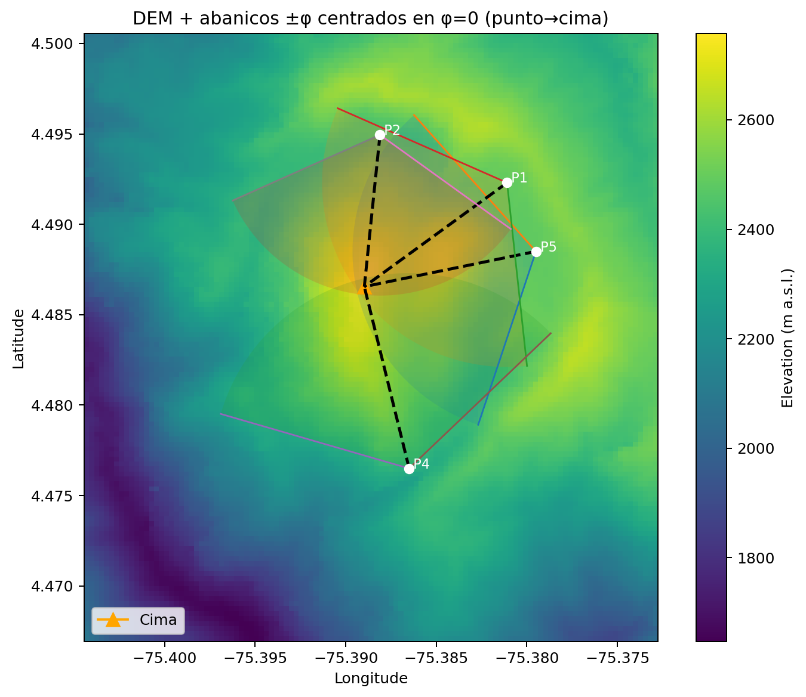
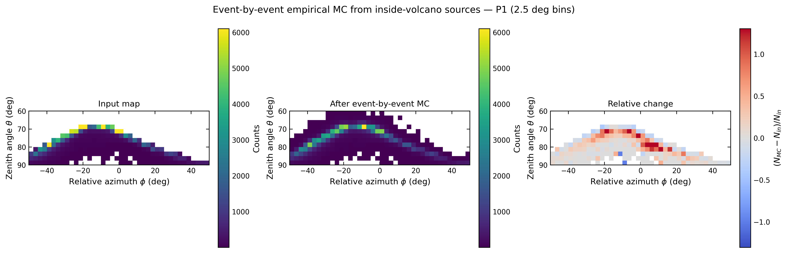
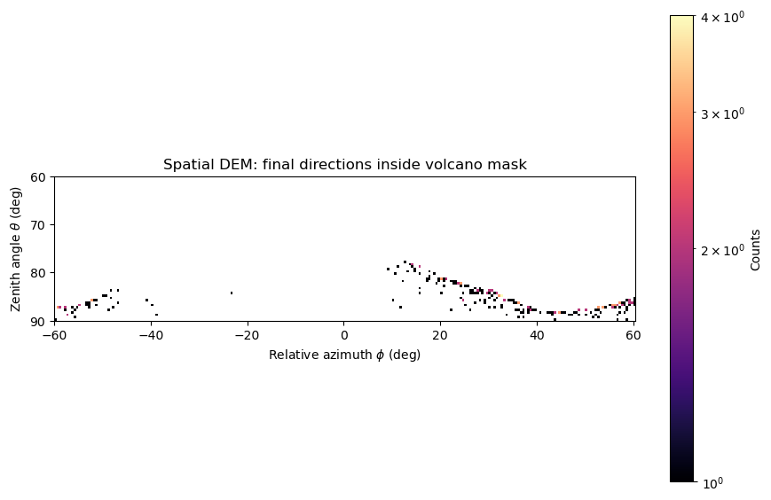

# Materiales CABRIALES para articulo PRIMS

Esta carpeta reúne una instantánea curada de la documentación, el código, las
figuras y los resultados resumidos necesarios para preparar un artículo sobre
CABRIALES. No contiene caches cinemáticos, archivos SHW, DEM, pesos duplicados
del modelo CNF ni corridas completas.

La fuente canónica sigue siendo el repositorio CABRIALES. Los archivos de esta
carpeta están pensados para lectura, carga en una herramienta editorial y
trazabilidad de las figuras.

## Contenido

```text
articulo_prims/
├── README.md
├── PROMPT_PARA_PRIMS.md
├── documentacion/
│   ├── README_CABRIALES.md
│   ├── USO_RAPIDO.md
│   ├── KERNEL_FULL_TAIL.md
│   └── README_MUON_CNF_TOOLKIT.md
├── codigo/
│   ├── cabriales.py
│   ├── orquestador_machin.py
│   ├── validar_corrida.py
│   ├── requirements.txt
│   ├── modulos/
│   ├── cnf/
│   ├── geant4/
│   └── utilidades_flujo/
├── imagenes/
│   ├── 00_readme/
│   ├── 01_geometria/
│   ├── 02_muogramas_filtrados/
│   ├── 03_event_mc/
│   └── 04_in_scattering/{P1,P2,P4,P5}/
└── resultados/
    ├── four_point_summary.json
    ├── four_point_summary.csv
    └── {P1,P2,P4,P5}/spatial_in_scattering_summary.json
```

## Figuras recomendadas

### Geometría y campo de visión



La carpeta `imagenes/01_geometria/` incluye además el FOV individual de cada
punto de observación.

### Muograma filtrado


Los mapas equivalentes de P2, P4 y P5 están en la misma carpeta.

### Migración angular interna



Estas figuras corresponden al event-by-event MC empírico con presentación
rebineada a 2.5 grados.

### In-scattering externo

| Dirección externa inicial | Dirección final aceptada |
|---|---|
|  |  |

Para cada punto también se incluyen el primer contacto con roca, la superficie
volcánica muestreada y el histograma de longitud de roca de los aceptados.

## Resultados resumidos de 90 días

**Trazabilidad:** cifras y mapas regenerados el 15 de julio de 2026 con todo el
cache cinemático de 90 días, `sample_probability=1`, 10 workers, semilla base
`12345` y el kernel `hybrid_empirical_kernel_library.npz`. Cada punto leyó
`1,363,053,739` eventos y registró cero pasos sin soporte del kernel. El
transporte espacial usó pasos nativos de `10 m` y corrección `1/(beta*p)` fuera
del rango energético medido. Véase
`documentacion/KERNEL_FULL_TAIL.md`.

| Punto | Aceptados MC / 90 d | Tasa superficial ideal [muones/(m2 dia)] | Área efectiva ideal | Escalado ideal por día | Exposición equivalente | Error relativo MC |
|---|---:|---:|---:|---:|---:|---:|
| P1 | 245 | 2.7222 | 1.5600 km2 | 4,246,666.67 | 4.98 s | 6.39% |
| P2 | 244 | 2.7111 | 2.5475 km2 | 6,906,555.56 | 3.05 s | 6.40% |
| P4 | 296 | 3.2889 | 3.7050 km2 | 12,185,333.33 | 2.10 s | 5.81% |
| P5 | 231 | 2.5667 | 1.6375 km2 | 4,202,916.67 | 4.75 s | 6.58% |
| Total | 1,016 | 2.9144 ponderada | 9.4500 km2 | 27,541,472.22 | 3.19 s ponderados | 3.14% para el conteo MC |

Las áreas de los cuatro puntos se suman como superficies objetivo específicas
de cada observador. No representan necesariamente un área física única y sin
solapamiento. La tasa superficial media ponderada por esas áreas es
`2.914 muones/(m2 dia)`; sigue siendo una tasa ideal de inyección y no una tasa
instrumental. Los tiempos equivalentes indican cuánto tardaría el área completa
en acumular el conteo MC mostrado; por punto se calculan como `90 d / A_eff`.

## Interpretación física obligatoria

El estudio distingue dos problemas:

1. Migración interna: dirección inicialmente aceptada que cambia a otro píxel
   aceptado por MCS.
2. In-scattering externo: dirección inicialmente fuera de la aceptación que
   atraviesa roca y termina con una dirección angular aceptada.

El segundo cálculo es un diagnóstico espacial ideal sobre superficie DEM. No
es reflexión ni rebote. El muón pierde energía y se deflecta por multiple
Coulomb scattering dentro de la roca.

El escalado por área **no es una tasa del detector**. Para convertirlo en una
predicción instrumental faltan, como mínimo, área física, orientación,
eficiencia e intersección espacial con el detector.

## Código

`codigo/` conserva el único orquestador, la interfaz simple, el validador y los
módulos físicos. El camino reproducible completo del repositorio original es:

```bash
python3 cabriales.py full --force
```

El perfil reproducido usa 10 workers por defecto y escribe el background bajo
`machin90d_4points_volcano_surface_step10m_workers10/`.

`codigo/cnf/` contiene los dos ejecutables del generador CNF y sus dependencias.
El peso `model.pt` no se duplica aquí; se encuentra en el repositorio principal
bajo `herramientas/muon-cnf-toolkit/model.pt`.

`codigo/geant4/` conserva el generador de casos cercanos al umbral usado para
estudios auxiliares del scattering. `codigo/utilidades_flujo/` reúne los scripts
de conversión y comparación angular de entradas SHW.

El archivo binario del kernel híbrido no se duplica en esta carpeta editorial.
Su nombre, procedencia, soporte y SHA-256 están documentados en
`documentacion/KERNEL_FULL_TAIL.md`; el modelo canónico vive en
`modulos/hybrid_empirical_kernel_library.npz` del repositorio principal.

## Orden sugerido para el artículo

1. Motivación de la muografía volcánica y contaminación angular.
2. Geometría DEM y aceptación de P1/P2/P4/P5.
3. Flujo CNF, normalización de 1 m2 y cache cinemático.
4. Longitud de roca, pérdida de energía y energía crítica.
5. Kernel empírico de MCS y migración angular interna.
6. Modelo espacial de in-scattering externo.
7. Validaciones numéricas y sensibilidad.
8. Resultados de 90 días para los cuatro puntos.
9. Limitaciones instrumentales y trabajo futuro.
